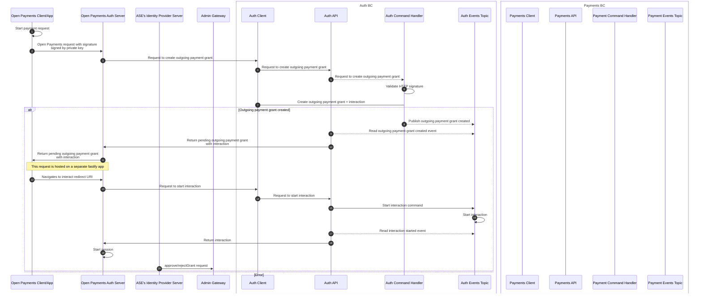

# Interactive grant flow

```mermaid
sequenceDiagram
	autonumber

    participant OPC as Open Payments Client/App
    participant OPAS as Open Payments Auth Server
    %% participant OPRS as Open Payments Resource Server
    participant IDP as ASE's Identity Provider Server
    participant AGW as Admin Gateway

    box Auth BC
    participant AC as Auth Client
    participant AAPI as Auth API
    participant ACH as Auth Command Handler
    participant AET as Auth Events Topic
    end

    box Payments BC
    participant PC as Payments Client
    participant PAPI as Payments API
    participant PCH as Payment Command Handler
    participant PET as Payment Events Topic
    end

    OPC ->> OPC: Start payment request
    OPC ->> OPAS: Open Payments request with signature <br> signed by private key
    OPAS ->> AC: Request to create outgoing payment grant
    AC ->> AAPI: Request to create outgoing payment grant
    AAPI -->> ACH: Request to create outgoing payment grant
    ACH -> ACH: Validate HTTP signature
    AC -> ACH: Create outgoing payment grant + interaction


    alt Outgoing payment grant created
    ACH -->> AET: Publish outgoing payment grant created
    AAPI -->> AET: Read outgoing payment grant created event
    AAPI ->> OPAS: Return pending outgoing payment grant <br> with interaction
    OPAS ->> OPC: Return pending outgoing payment grant <br> with interaction

    note over OPC, OPAS: This request is hosted on a separate fastify app
    OPC ->> OPAS: Navigates to interact redirect URI

    OPAS ->> AC: Request to start interaction
    AC ->> AAPI: Request to start interaction
    AAPI ->> AET: Start interaction command
    AET ->> AET: Start interaction
    AAPI -->> AET: Read interaction started event
    AAPI ->> OPAS: Return interaction
    OPAS ->> OPAS: Start session

    IDP ->> AGW: approve/rejectGrant request
    else Error

    end
```
