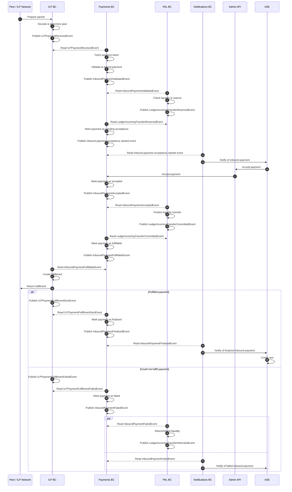

# Remote Outgoing Payment - Receiving

```mermaid
sequenceDiagram
	autonumber


    participant Peer as Peer / ILP Network
    participant ILPBC as ILP BC
    participant PBC as Payments BC
    participant PAL as PAL BC
    participant NBC as Notifications BC
    participant AAPI as Admin API
    participant ASE as ASE

    Peer ->> ILPBC: Prepare packet
    ILPBC ->> ILPBC: Decode & determine peer
    ILPBC ->> ILPBC: Publish ILPPaymentReceivedEvent

    PBC -->> ILPBC: Read ILPPaymentReceivedEvent
    PBC ->> PBC: Fetch payment intent
    PBC ->> PBC: Validate & persist payment
    PBC ->> PBC: Publish InboundPaymentValidatedEvent

    PAL -->> PBC: Read InboundPaymentValidatedEvent
    PAL ->> PAL: Check liquidity & reserve
    PAL ->> PAL: Publish LedgerIncomingTransferReservedEvent

    PBC -->> PAL: Read LedgerIncomingTransferReservedEvent
    PBC ->> PBC: Mark payment as pending acceptance
    PBC ->> PBC: Publish inbound payment acceptance started event

    NBC -->> PBC: Read inbound payment acceptance started event
    NBC ->> ASE: Notify of inbound payment
    ASE ->> AAPI: Accept payment
    AAPI ->> PBC: Accept payment
    PBC ->> PBC: Mark payment as accepted
    PBC ->> PBC: Publish InboundPaymentAcceptedEvent

    PAL -->> PBC: Read InboundPaymentAcceptedEvent
    PAL ->> PAL: Finalize liquidity transfer
    PAL ->> PAL: Publish LedgerIncomingTransferCommittedEvent

    PBC -->> PAL: Read LedgerIncomingTransferCommittedEvent


    PBC ->> PBC: Mark payment as fulfillable
    PBC ->> PBC: Publish InboundPaymentFulfillableEvent
    ILPBC -->> PBC: Read InboundPaymentFulfillableEvent
    ILPBC ->> ILPBC: Create fulfillment
    ILPBC ->> Peer: Return fulfillment

    alt Fulfilled payment
    ILPBC ->> ILPBC: Publish ILPPaymentFulfillmentSentEvent
    PBC -->> ILPBC: Read ILPPaymentFulfillmentSentEvent
    PBC ->> PBC: Mark payment as finalized
    PBC ->> PBC: Publish InboundPaymentFinalizedEvent
    NBC -->> PBC: Read InboundPaymentFinalizedEvent
    NBC ->> ASE: Notify of finalized inbound payment
    ASE ->> ASE: Credit user

    else Could not fulfill payment
    ILPBC ->> ILPBC: Publish ILPPaymentFulfillmentFailedEvent
    PBC -->> ILPBC: Read ILPPaymentFulfillmentFailedEvent
    PBC ->> PBC: Mark payment as failed
    PBC ->> PBC: Publish InboundPaymentFailedEvent
    par
    PAL -->> PBC: Read InboundPaymentFailedEvent
    PAL ->> PAL: Return/refund liquidity
    PAL ->> PAL: Publish LedgerIncomingTransferRefundedEvent
    and
    NBC -->> PBC: Read InboundPaymentFailedEvent
    NBC ->> ASE: Notify of failed inbound payment
    end
    end
```
