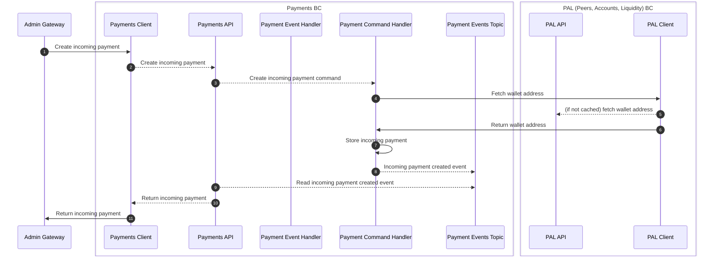

# Incoming Payment Creation (Admin API)

```mermaid
sequenceDiagram
	autonumber

    participant AGW as Admin Gateway

    box Payments BC
    participant PC as Payments Client
    participant PAPI as Payments API
	participant PEH as Payment Event Handler
    participant PCH as Payment Command Handler
    participant PET as Payment Events Topic
    end

    box PAL (Peers, Accounts, Liquidity) BC
    participant PALAPI as PAL API
    participant PALC as PAL Client
    end


    AGW ->> PC: Create incoming payment
    PC -->> PAPI: Create incoming payment
    PAPI -->> PCH: Create incoming payment command
    PCH ->> PALC: Fetch wallet address
    PALC -->> PALAPI: (if not cached) fetch wallet address
    PALC ->> PCH: Return wallet address
    PCH ->> PCH: Store incoming payment
    PCH -->> PET: Incoming payment created event
    PAPI -->> PET: Read incoming payment created event
    PAPI -->> PC: Return incoming payment
    PC ->> AGW: Return incoming payment
```
