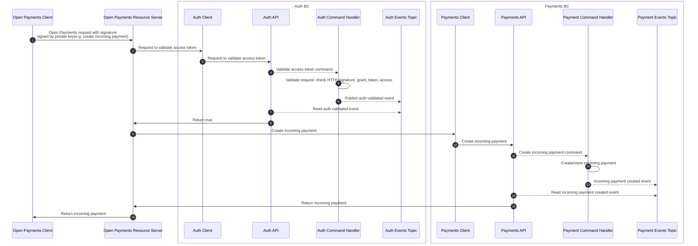

# Incoming Payment Creation (Open Payments API)

```mermaid
sequenceDiagram
	autonumber

    participant OPC as Open Payments Client
    participant OPRS as Open Payments Resource Server

    box Auth BC
    participant AC as Auth Client
    participant AAPI as Auth API
    participant ACH as Auth Command Handler
    participant AET as Auth Events Topic
    end

    box Payments BC
    participant PC as Payments Client
    participant PAPI as Payments API
    participant PCH as Payment Command Handler
    participant PET as Payment Events Topic
    end

    OPC ->> OPRS: Open Payments request with signature <br> signed by private key(e.g. create incoming payment)
    OPRS ->> AC: Request to validate access token
    AC ->> AAPI: Request to validate access token
    AAPI -->> ACH: Validate access token command
    ACH -> ACH: Validate request: check HTTP signature, grant, token, access

    %% alt Access token is valid
    ACH -->> AET: Publish auth validated event
    AAPI -->> AET: Read auth validated event
    AAPI ->> OPRS: Return true
    OPRS ->> PC: Create incoming payment
    PC ->> PAPI: Create incoming payment
    PAPI -->> PCH: Create incoming payment command
    PCH -> PCH: Create/store incoming payment
    PCH -->> PET: Incoming payment created event
    PAPI -->> PET: Read incoming payment created event
    PAPI ->> OPRS: Return incoming payment
    OPRS ->> OPC: Return incoming payment

    %% else Access token is invalid
    %% ACH -->> AET: Publish auth failed event
    %% AAPI -->> AET: Read auth failed event
    %% AAPI ->> OPRS: Return error
    %% OPRS ->> OPC: Return error
    %% end
```
