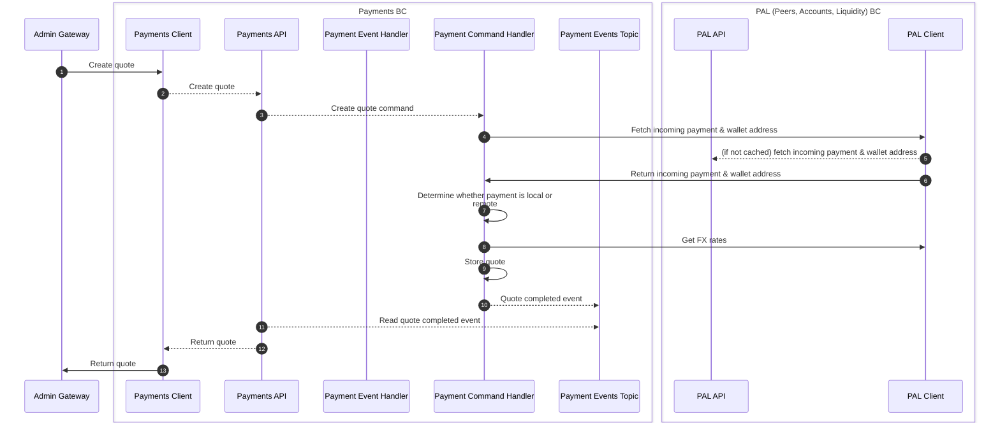

# Local quote creation

```mermaid
sequenceDiagram
	autonumber

    participant AGW as Admin Gateway

    box Payments BC
    participant PC as Payments Client
    participant PAPI as Payments API
	participant PEH as Payment Event Handler
    participant PCH as Payment Command Handler
    participant PET as Payment Events Topic
    end

    box PAL (Peers, Accounts, Liquidity) BC
    participant PALAPI as PAL API
    participant PALC as PAL Client
    end


    AGW ->> PC: Create quote
    PC -->> PAPI: Create quote
    PAPI -->> PCH: Create quote command
    PCH ->> PALC: Fetch incoming payment & wallet address
    PALC -->> PALAPI: (if not cached) fetch incoming payment & wallet address
    PALC ->> PCH: Return incoming payment & wallet address
	PCH ->> PCH: Determine whether payment is local or <br> remote
    PCH ->> PALC: Get FX rates
    PCH ->> PCH: Store quote
    PCH -->> PET: Quote completed event
    PAPI -->> PET: Read quote completed event
    PAPI -->> PC: Return quote
    PC ->> AGW: Return quote
```
